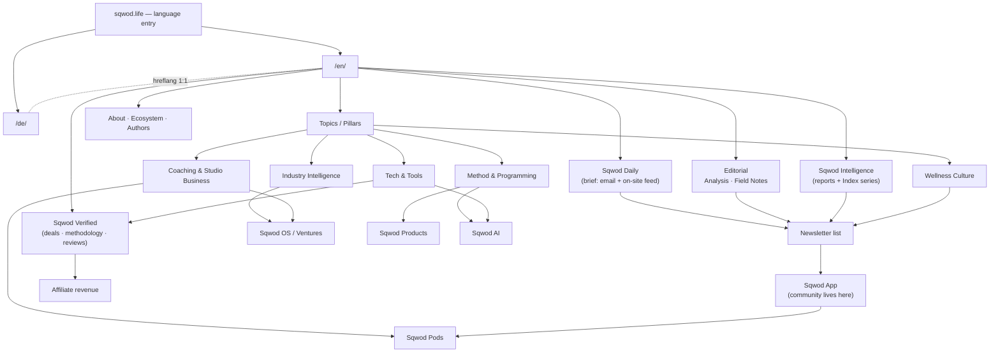

# sqwod.life — Information Architecture & Sitemap (v1)

*Phase 2. Built on locked names: **Sqwod Daily** (brief), **Sqwod Intelligence** (reports), **Sqwod Verified** (deals). Community = a layer across the newsletter + the Sqwod app, not a separate forum. Visual: pure monochrome (ink `#111113` / chalk `#FAFAFA`), diamond-seed mark.*

---

## 1. Locale & URL strategy (the bilingual spine)

**Recommendation: subdirectory locales on one domain** — `sqwod.life/en/…` and `sqwod.life/de/…`.

- One domain concentrates SEO authority (vs. splitting across `de.` subdomains or a `.de` ccTLD). Best multilingual-SEO posture for a single global brand.
- Every URL has a 1:1 counterpart in the other language, wired with `hreflang` tags + a self-referencing canonical. This is what "true parity" means structurally: no orphan pages in either language.
- **Slugs localize.** Section *labels* (brand terms) stay constant; the slug words translate. Example:
  - `sqwod.life/en/coaching-business/retention-playbook`
  - `sqwod.life/de/coaching-business/retention-playbook` → `…/coaching-business/kundenbindung-playbook`
- Root `sqwod.life/` detects `Accept-Language` once, offers a language switch, and never traps the user — the switcher is always in the header and lands on the *equivalent* page, not the homepage.
- Generated automatically: `sitemap.xml` (per-locale), `hreflang` map, RSS per section/locale, `robots.txt`.

Trade-off flagged: subdirectories require the app/server to handle routing (trivial in a Claude-Code-owned Astro/Next stack). The payoff is one compounding domain instead of two weak ones. I'm confident here unless you have a reason to want separate `.de` branding.

---

## 2. Top-level navigation

Lean primary nav (same in both locales):

**Sqwod Daily · Intelligence · Topics · Sqwod Verified · About**
Plus persistent utilities: **Subscribe** (primary CTA, high-contrast), **Search**, **Language switch (EN/DE)**, **Get the App**.

"Topics" is the pillar hub. "Analysis" and "Field Notes" live *inside* Topics and Daily rather than eating a top-level slot — keeps the bar uncluttered and pushes the two highest-value destinations (Daily, Verified) forward.

---

## 3. Complete sitemap

Shown once; the entire tree exists identically under `/en/` and `/de/`.

```
sqwod.life/
├── /                                  Home (language-detected entry)
│
├── /[lang]/                           Localized home
│   ├── daily/                         SQWOD DAILY — the brief
│   │   ├── /                          Live feed (on-site version of the brief)
│   │   ├── /{yyyy}/{mm}/{dd}          Individual daily issue (archive)
│   │   └── /subscribe                 Brief signup (feeds newsletter)
│   │
│   ├── analysis/                      Long-form articles
│   │   ├── /                          Index (filter by pillar)
│   │   └── /{slug}                    Article
│   │
│   ├── field-notes/                   Short takes / quick reads
│   │   ├── /                          Index
│   │   └── /{slug}                    Note
│   │
│   ├── intelligence/                  SQWOD INTELLIGENCE — reports
│   │   ├── /                          Report library
│   │   ├── /{slug}                    Individual report (gated/ungated mix)
│   │   └── /index/{slug}              "The {X} Index" recurring data series
│   │
│   ├── topics/                        PILLAR HUB
│   │   ├── /industry-intelligence
│   │   ├── /coaching-business         (primary conversion pillar)
│   │   ├── /method-programming
│   │   ├── /tech-tools
│   │   └── /wellness-culture
│   │
│   ├── verified/                      SQWOD VERIFIED — deals/affiliate
│   │   ├── /                          Hub: categories + latest "best of"
│   │   ├── /{category}                Category buyer's guide (e.g. /wearables)
│   │   ├── /{category}/best-{x}       "Best of" roundup
│   │   ├── /reviews/{product-slug}    Single product review (standard template)
│   │   ├── /methodology               Scorecard & ranking methodology (visible)
│   │   └── /disclosure                Affiliate disclosure (DE + EN compliant)
│   │
│   ├── newsroom/                      Press releases
│   │   ├── /
│   │   └── /{slug}
│   │
│   ├── app/                           Get the Sqwod App (community + product)
│   ├── about/                         Brand, mission, team
│   │   ├── /ecosystem                 The Sqwod ecosystem map (conversion hub)
│   │   ├── /authors/{name}            Author pages (E-E-A-T / credibility)
│   │   └── /contact
│   │
│   ├── subscribe/                     Newsletter landing (list + community entry)
│   ├── search/
│   └── tags/{tag}                     Cross-pillar tag archives
│
└── Legal & system (per locale)
    ├── /impressum                     REQUIRED in DE (TMG §5)
    ├── /datenschutz  · /privacy       GDPR privacy policy
    ├── /agb · /terms                  Terms
    ├── /cookies                       Cookie/consent policy (links to CMP)
    ├── sitemap.xml · robots.txt · rss · hreflang map
```

---

## 4. IA diagram



---

## 5. The taxonomy (every piece tagged on 4 axes)

This is the connective tissue that makes the conversion engine measurable. Every article, brief item, report, and review carries:

| Axis | Values |
|---|---|
| **Pillar** | Industry Intelligence · Coaching & Studio Business · Method & Programming · Tech & Tools · Wellness Culture |
| **Language** | `en` · `de` (every piece declares its counterpart) |
| **Format** | Daily item · Analysis · Field Note · Report · Index · Review · Buyer's Guide · Press Release |
| **Conversion path** | Pods · Sqwod OS · Products · Sqwod AI · Verified/Affiliate · List-growth |

With these four axes you can answer, at any time: *which pillar drives the most Pod conversions? which format grows the list fastest? is DE keeping parity with EN?* — the instrumentation the brief asks for, built into the content model itself rather than bolted on. (This is the bridge into Phase 3, where I detail the cascade: one source doc → report → article → daily item → newsletter → social.)

---

## 6. Community model (your answer, made structural)

Community is **not** a separate destination — it's the relationship layer that lives in two places already in the funnel:

1. **The newsletter** — Sqwod Daily + the list. Identity, replies, engagement, segmentation by pillar interest.
2. **The Sqwod app** — where readers become users (and the on-ramp to Pods/products).

So sqwod.life's job is to *feed both*: every page has a contextual subscribe moment, and the app is a persistent nav item. There is no `/community` forum to build or moderate. A future paid tier (Phase 5) would sit as a premium layer on the newsletter/app, not a new section here.

---

## 7. Compliance baked into the IA (both markets)

- **Impressum** — legally mandatory in Germany (TMG §5); permanent footer link, both locales.
- **Datenschutz / Privacy** — GDPR-compliant; drives the consent-managed analytics in Phase 5.
- **Affiliate labeling** — Sqwod Verified pages carry clear paid/affiliate labels per German UWG ("Werbung"/"Anzeige") and FTC-style disclosure for EN, plus the `/verified/disclosure` page and a visible `/verified/methodology` scorecard. Trust is the product on these pages.
- **Cookie/consent (CMP)** — gates non-essential tracking before load; required for GDPR and clean affiliate attribution.

---

## 8. Decisions before Phase 3 (pillars & taxonomy cascade)

1. **URL strategy:** confirm subdirectory locales (`/en/`, `/de/`) over separate domains.
2. **Reports access:** should Sqwod Intelligence reports be email-gated (list growth) or open (reach/SEO)? My lean: a mix — flagship reports gated, "Index" data series open.
3. **App nav prominence:** "Get the App" as a primary nav CTA, or secondary in footer/contextual? My lean: primary, since the app *is* the community + product on-ramp.

Confirm these and I'll build Phase 3: the five pillars operationalized, the full tagging taxonomy, and the automation cascade that turns one Statista source into a report, an article, a Daily item, a newsletter, and social — in both languages.
