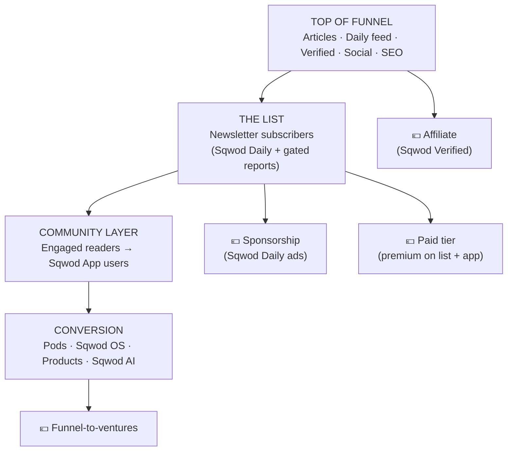

# Newsletter, Community & Monetization Funnel (v1)

*Phase 5. The business model. Four revenue streams stood up from day one, each instrumented so performance — not a guess — decides where we double down.*

---

## 1. The funnel, end to end

The list is the fulcrum: it's the audience asset everything monetizes against, and the bridge into the app where readers become users and (eventually) customers.

---

## 2. The newsletter (list-building machine)

**Capture, everywhere, contextually.** Every surface has a native subscribe moment: inline mid-article, end-of-piece, a sticky bar, exit intent, and gated-report unlocks. Sqwod Daily's on-site feed always offers the email version.

**GDPR-clean by design (DE-critical):** double opt-in, explicit consent, clear value statement, one-click unsubscribe, consent records stored. This is mandatory in Germany and protects deliverability everywhere.

**Segmentation from signup:** subscribers are tagged by **pillar interest** (inferred from entry content + a light onboarding question) and **language**. This powers relevant sends and per-segment conversion measurement — and feeds the `conversion` analytics from Phase 3.

**Welcome sequence (bilingual, automated):** 3–4 emails — the manifesto (rebel/operator positioning), best-of reports, the Sqwod ecosystem intro (soft), and a "what do you want more of" segmenter. Drafted by Claude in EN + DE.

**Deliverability discipline:** authenticated domain (SPF/DKIM/DMARC), warmed sender, engagement-based list hygiene. Boring, essential, and where most newsletters quietly fail.

---

## 3. Community model (newsletter + app, not a forum)

Per your call, community isn't a separate product to build and moderate — it's the **relationship layer** across two assets you already have:

- **Newsletter** — replies, polls, segmentation, reader features in the Daily. Low-cost, high-signal engagement.
- **Sqwod App** — where the most engaged readers convert into *users*, and the on-ramp to Pods/products. sqwod.life's job is to drive subscribers into the app.

So "community growth" = list growth × app activation. No `/community` build cost; the engagement lives where the funnel already runs.

---

## 4. The four revenue streams (all live day one, all instrumented)

### Stream 1 — Affiliate (Sqwod Verified)
Detailed in Phase 4. Revenue per product/category tracked via consent-gated first-party click tracking → tied to `conversion: verified`. **Measure:** revenue per 1k pageviews, top categories, EN vs DE.

### Stream 2 — Sponsorship (Sqwod Daily ads)
- **Native primary ad** in each Daily issue + matching slot in the on-site feed (one pipeline, two surfaces). Format: short, on-brand, clearly labeled **"Präsentiert von / Presented by."**
- **Inventory:** 1 primary + 1 secondary classified-style slot per issue. Scarcity protects value.
- **Pricing logic:** CPM-anchored to verified subscriber count + open rate; start with a flat per-issue rate, move to a rate card as the list grows. German labeling rules (Werbung/Anzeige) apply.
- **Measure:** fill rate, CPM, advertiser retention, subscriber response.

### Stream 3 — Paid tier (premium layer on list + app)
A premium membership sitting on the newsletter + app — *not* a new section. Candidate value: full Sqwod Intelligence report archive, exclusive data/Index tools, deeper benchmarks, ad-free Daily, priority/community access via the app, member events.
- **Posture:** launch the *plumbing* day one (a paywall/membership mechanism + 1–2 premium artifacts) even if the price is introductory, so we can measure willingness-to-pay early.
- **Measure:** free→paid conversion, churn, ARPU, which content drives upgrades.

### Stream 4 — Funnel-to-ventures
The strategic core: qualified operators → **Sqwod Pods, Sqwod OS, Sqwod products, Sqwod AI.** Every pillar routes natively (Phase 3). Tracked with campaign tags + first-party attribution from content → app/booking.
- **Measure:** content-attributed Pod bookings, OS signups, product sales, AI activations — the numbers that prove the hub thesis.

---

## 5. Instrumentation (so performance decides)

The brief is explicit: stand all streams up, measure, optimize. Mechanism:

- **One event spine:** consent-gated, first-party analytics (GDPR-safe) capturing pageview → subscribe → segment → click/convert, every event carrying the Phase 3 tags (`pillar`, `lang`, `format`, `conversion`).
- **Attribution:** first-party, last-touch to start (clean and lawful), with content-source provenance so we can credit the *piece* that drove a Pod booking or affiliate sale.
- **One scoreboard:** a single dashboard with the four streams side by side + list growth and DE/EN parity. This is a natural **live Cowork artifact** later — a page you reopen each morning that pulls fresh numbers. (Flagging it now; building it belongs with the stack in Phase 6.)
- **The decision loop:** monthly, read the scoreboard, shift editorial/effort toward the stream and pillar with the best return. No stream is privileged at launch — the data ranks them.

**Launch KPIs (first 90 days):** subscriber count + growth rate, DE/EN parity ratio, Daily open/click, affiliate rev/1k views, sponsorship fill, free→paid conversion, content-attributed venture actions.

---

## 6. Decisions before Phase 6 (stack + roadmap)

1. **Paid tier at MVP:** stand up the membership plumbing + a couple of premium artifacts from day one (my lean), or defer the paywall to V1 and focus MVP on list + affiliate + sponsorship?
2. **Sponsorship at MVP:** open Daily ad inventory immediately (even at a low founder rate to prove the model), or wait until the list hits a threshold (e.g. ~2–3k)?
3. **Scoreboard surface:** want the metrics scoreboard built as a live Cowork artifact you check each morning? (My lean: yes — it's exactly what the format is for.)

That's the last gate. Confirm or let me keep driving, and I'll close the engagement with Phase 6: the recommended code-first tech stack (what Claude Code builds vs. which 3rd-party tools to plug in), the living-wiki technical design, and the phased **MVP → V1 → Scale** roadmap with what ships in each.
