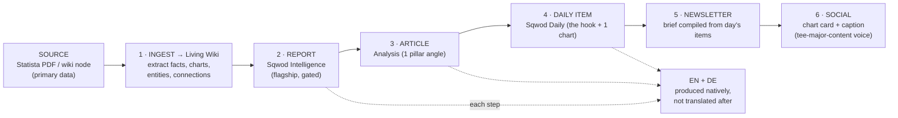

# sqwod.life — Pillars, Taxonomy & the Automation Cascade (v1)

*Phase 3. The content engine. This is where the "automation-first" principle becomes a machine: one source document → many formats → both languages → measurable conversion.*

---

## 1. The five pillars, operationalized

Each pillar is a *beat* with a defined job, a reader, recurring content types, and one primary conversion path. The split: **Coaching & Studio Business** is the money pillar, **Wellness Culture** is the reach pillar, and the other three are the credibility that makes both work.

### Pillar 1 — Industry Intelligence
- **Job:** Establish authority. Market size, trends, M&A, funding, Statista-backed data.
- **Reader:** Operators, founders, investors-adjacent.
- **Recurring types:** Quarterly market reports, "Index" data series, trend breakdowns, funding roundups.
- **Conversion path:** Ventures / Sqwod OS.
- **Example angles:** *EN: "The €X billion German wellness market, in 6 charts." · DE: "Der deutsche Wellnessmarkt in 6 Charts."*

### Pillar 2 — Coaching & Studio Business  ★ primary conversion
- **Job:** Make coaches/PTs/studio founders more money and reduce their pain. Client acquisition, retention, pricing, ops, hiring, space economics.
- **Reader:** The exact buyer of Sqwod Pods + Sqwod OS.
- **Recurring types:** Playbooks, teardowns of real businesses, benchmark pieces ("what top studios charge"), tool comparisons.
- **Conversion path:** **Sqwod Pods + Sqwod OS.**
- **Example angles:** *EN: "The retention math that decides if your studio survives." · DE: "Die Kundenbindungs-Rechnung, die über dein Studio entscheidet."*

### Pillar 3 — Method & Programming
- **Job:** Earn respect on the training science. Methodology, programming, evidence.
- **Reader:** Serious coaches, the credibility crowd.
- **Recurring types:** Evidence reviews, programming frameworks, "what the research says" explainers.
- **Conversion path:** Sqwod products + Sqwod AI.
- **Example angles:** *EN: "Zone 2, decoded for coaches who actually program it." · DE: "Zone 2 — für Coaches, die es wirklich programmieren."*

### Pillar 4 — Tech & Tools
- **Job:** Be the trusted filter on wearables, apps, AI in wellness.
- **Reader:** Early-adopter operators and gear-curious readers.
- **Recurring types:** Product deep-dives, category explainers, "AI in your practice" guides → **directly feeds Sqwod Verified.**
- **Conversion path:** Sqwod Verified (deals) + Sqwod AI.
- **Example angles:** *EN: "Every coaching AI tool, ranked by what it actually saves you." · DE: "Jedes KI-Coaching-Tool, nach echtem Zeitgewinn sortiert."*

### Pillar 5 — Wellness Culture  ★ reach
- **Job:** Maximum top-of-funnel reach. Longevity, recovery, nutrition, consumer trends.
- **Reader:** The broad wellness audience (widest net = fastest list growth).
- **Recurring types:** Trend pieces, consumer-shift explainers, shareable data viz.
- **Conversion path:** List growth → newsletter + deals.
- **Example angles:** *EN: "The recovery economy is eating the supplement aisle." · DE: "Die Recovery-Ökonomie frisst das Supplement-Regal."*

---

## 2. The content model (the tagging schema, implementable)

Every content object — Daily item, Analysis, Field Note, Report, Index, Review, Buyer's Guide, Press Release — carries this front-matter. Controlled vocabularies (no free-text on the key axes) so the analytics actually aggregate.

```yaml
# every piece of content carries this
id:            sl-2026-0412            # stable, language-agnostic
lang:          en | de
counterpart:   sl-2026-0412 (the other language's id)   # enforces 1:1 parity
title:         string
slug:          localized
format:        daily | analysis | field-note | report | index | review | guide | press
pillar:        industry-intelligence | coaching-business | method-programming
               | tech-tools | wellness-culture
conversion:    pods | sqwod-os | products | sqwod-ai | verified | list-growth
source_ids:    [wiki node / Statista ref ids]   # provenance → the living wiki
status:        draft | review | published
published_at:  datetime
author:        author-id
tags:          [free-ish, but from a governed tag list]
gated:         true | false            # reports: flagship=true, index=false
sponsor:       sponsor-id | null       # daily-brief ad attribution
affiliate:     true | false            # Verified pages
```

**Why it matters:** with `pillar × lang × format × conversion` on every object plus `source_ids` for provenance, you can answer at a glance: *which pillar drives Pod conversions, which format grows the list fastest, is DE at parity with EN, and which source document produced the most downstream value.* The instrumentation the brief demands is structural, not bolted on.

---

## 3. The automation cascade (one source → many formats → both languages)

This is the core of the brief's "cascade from a single source document into multiple formats." Each step is a defined Claude workflow run off the source.



**Step detail:**

1. **Ingest** — Claude reads the source, extracts facts/figures/entities, renders charts in the monochrome system, and writes structured notes *into the living wiki* (Section 4). Nothing is published yet — this builds the asset base.
2. **Report** — the flagship long-form Sqwod Intelligence piece, fully cited to source. Gated.
3. **Article** — one pillar-specific Analysis angle pulled from the report (e.g. the report's coaching implications → a Coaching & Studio Business piece).
4. **Daily item** — the single sharpest "so what" + one chart, sized for the brief.
5. **Newsletter** — the day's items compiled into Sqwod Daily (email) and the on-site feed — one pipeline, two surfaces.
6. **Social** — chart card + caption in your existing voice (the `tee-major-content` skill plugs in here).

**Bilingual rule:** every step produces EN *and* DE as first-class outputs in the same run — never "publish EN, translate later." German is authored, not post-processed, which is what keeps parity real and the SEO clean.

**Output per source:** 1 report + 1–3 articles + several daily items + 1 newsletter slot + a social set — **× 2 languages.** One source document can responsibly yield 15–20 content objects.

---

## 4. The living knowledge wiki (your "gets smarter over time" backbone)

Not a content folder — a **knowledge graph** that compounds. Three object types:

- **Nodes** = entities the industry is made of: companies, products, people, concepts, markets, methods, regulations.
- **Facts** = atomic, sourced data points attached to nodes (every fact cites a `source_id` — a Statista page, a filing, a study).
- **Edges** = relationships: *competes-with, acquired-by, supplier-of, evidence-for, trend-within.*

How it gets smarter:
1. **Every ingest enriches it** — new facts attach to existing nodes; new nodes link to old ones.
2. **Claude proposes new edges** on each run ("this 2026 wearable funding fact connects to the 2024 recovery-market node") — surfacing non-obvious connections that *become* article angles.
3. **Staleness flags** — facts carry dates; the wiki flags what needs refreshing, which itself generates "updated Index" content.
4. **It's the single source of truth** every cascade reads from and writes to — so coverage and citations strengthen with every piece instead of starting from zero.

This is the moat: competitors publish articles; we accumulate a connected, sourced intelligence base that makes each new piece faster to produce and harder to match. (Full technical design — storage, retrieval, how Claude Code operates it — lands in Phase 6 with the stack.)

---

## 5. Daily brief cadence (calibrated to automation capacity)

Volume follows what the cascade can *reliably* produce at quality, per the brief — not an arbitrary target.

- **Launch (MVP):** Sqwod Daily ships **3×/week**, EN + DE, ~3 items each, every item traceable to a source. Proves the pipeline and parity without overcommitting.
- **V1:** **5×/week (weekdays)** once the wiki has depth and the cascade is smooth.
- **Scale:** daily + pillar-specific editions only if engagement data justifies the editorial load.

Better a tight 3×/week that's genuinely useful and on-time in both languages than a daily that degrades or breaks parity.

---

## 6. Decisions before Phase 4 (Sqwod Verified architecture)

1. **Cascade ownership:** comfortable with Claude running ingest → draft for *all* formats with you as editor-in-chief approving before publish? (My assumption: yes, human-in-the-loop on publish.)
2. **Launch cadence:** confirm 3×/week bilingual Sqwod Daily at MVP?
3. **First beats:** which 2 pillars do we seed content in first? My lean: **Coaching & Studio Business** (money) + **Wellness Culture** (reach), so we test conversion and list-growth from day one.

Confirm and I move to Phase 4: the Sqwod Verified deals architecture — category guides, the weighted scorecard methodology, the review template, and DE/EN affiliate compliance.
