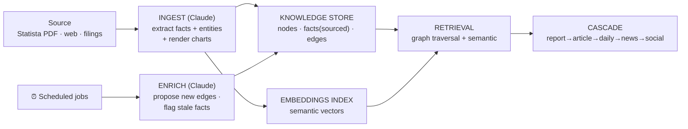

# Tech Stack, Living-Wiki Architecture & Roadmap (v1)

*Phase 6. The build plan. Optimized for: bilingual content at scale, automated generation, multilingual SEO, newsletter/community, affiliate flexibility, fast iteration — and a stack Claude Code can own end-to-end, plugging in managed services only where they earn it.*

---

## 1. Recommended stack (with rationale)

**Core principle:** the repo *is* the product. Git-based content + a static-first framework means Claude Code authors, versions, and ships everything, with no CMS lock-in and no per-seat SaaS tax on the thing that matters most — publishing.

| Layer | Recommendation | Why |
|---|---|---|
| **Framework** | **Astro** (+ React islands) | Content-first, ships near-zero JS → fast = great SEO. First-class i18n routing for `/en//de/`. MD/MDX content collections match the Phase 3 front-matter schema exactly. Your `CoachThinking.jsx` drops in as an island. Trivial for Claude Code to own. |
| **Content store** | **MDX in the repo** (Git as CMS) | Claude authors content as files carrying the tagging schema. Version-controlled, reviewable, zero CMS cost. A light headless layer can come later if non-technical editors need it. |
| **Hosting/deploy** | **Cloudflare Pages** (or Vercel) | Edge-fast, cheap, EU-friendly. Git push → deploy. Vercel if you prefer DX; Cloudflare if you prefer cost/edge + EU posture. |
| **Newsletter / ESP** | **beehiiv** (primary) | Purpose-built for newsletter *media brands*: native paid subscriptions, built-in ad/sponsorship tooling, referral program, web+email, strong API. Collapses 3 of 4 revenue streams into one tool. *Trade-off:* US-hosted → run a DPA + consent; EU-data alternative is **MailerLite/Brevo** if data residency must be EU. |
| **Paywall/membership** | beehiiv paid (MVP) → **Stripe**-based custom (when tied to the app) | Start with beehiiv's native paid tier; graduate to Stripe when membership links to app entitlements. |
| **Analytics** | **Plausible** (EU, cookieless web) + **PostHog** (EU region, funnels/events) | Plausible = lightweight, GDPR-friendly traffic. PostHog = the event spine (pageview→subscribe→convert) carrying Phase 3 tags. |
| **Consent (CMP)** | **Usercentrics** (Munich) or Cookiebot | German-market credibility; gates affiliate/marketing tracking lawfully. |
| **On-site search** | **Pagefind** | Static, builds with the site, zero infra, bilingual. Algolia only if we outgrow it. |
| **Affiliate links** | Custom **`/go/{slug}`** redirect + first-party click tracking | Claude-ownable, clean attribution, `rel="sponsored"`, no SaaS needed at MVP. |
| **Living wiki** | Repo-structured knowledge files + embeddings (MVP) → Postgres + pgvector (V1) → graph+vector (Scale) | See §2. Grows from Git-native to a real graph as it earns the complexity. |
| **Orchestration** | **Claude** (Cowork/Claude Code) + scheduled tasks | Runs the cascade and the wiki enrichment on a schedule. |

**What Claude Code builds vs. plugs in:** Claude Code builds the site, design system, templates, content, the affiliate redirect layer, the wiki, and the automation. It *plugs in* managed services for the hard-to-own, compliance-sensitive parts: email delivery (beehiiv), payments (Stripe), consent (Usercentrics), analytics (Plausible/PostHog). That's the right ownership line.

---

## 2. The living wiki — technical design

The knowledge graph from Phase 3 (nodes / facts / edges), built to compound.

**Maturity path:**
- **MVP (v0):** nodes/facts/edges as structured JSON/MD in the repo + a local embeddings index. Claude reads/writes directly. Good enough to power the cascade and prove the loop.
- **V1:** migrate to **Postgres + pgvector** — relational facts + vector search in one store; scheduled enrichment jobs run nightly to propose edges and flag staleness; staleness drives "updated Index" content automatically.
- **Scale:** dedicated graph layer (e.g. Neo4j) + managed vector store; near-autonomous ingest; the "Index" data series becomes a premium data product.

**Why it's the moat:** every ingest makes the next piece faster to write and better-cited, and the edge-proposal loop literally generates article angles competitors can't see. Coverage compounds; they start from zero each time.

---

## 3. Roadmap — MVP → V1 → Scale

```mermaid
gantt
    title sqwod.life build roadmap
    dateFormat X
    axisFormat %s
    section MVP (~8 wks)
    Site + design system + legal      :0, 3
    Content engine + first 2 pillars  :1, 4
    Newsletter + reports + Verified    :2, 5
    Wiki v0 + analytics + scoreboard   :3, 6
    section V1 (mo 3-6)
    5x/wk Daily + all 5 pillars        :6, 9
    Wiki v1 (pgvector) + enrichment    :6, 10
    Paid tier value + rate card        :7, 10
    section Scale (6 mo+)
    Daily + pillar editions            :10, 13
    Graph+vector wiki + data products  :10, 14
    Sponsorship marketplace + ventures :11, 14
```

### MVP — *prove the loop* (~8 weeks)
**Ships:**
- Astro site, bilingual `/en//de/` with hreflang, **monochrome design system from the app brand** (ink/chalk, diamond-seed mark, CoachThinking island).
- Core templates: home, article, Daily feed, pillar hubs, About/Ecosystem, authors, **legal (Impressum, Datenschutz, disclosure, cookies)**.
- Content model live (front-matter schema); **seed Coaching & Studio Business + Wellness Culture**.
- **Sqwod Daily 3×/week, EN+DE**; welcome sequence; double opt-in (beehiiv).
- 1–2 flagship **gated reports** + open **Index** series.
- **Sqwod Verified**: 2 categories (Wearables + Coaching apps), methodology page, review template, compliance.
- Affiliate redirect + tracking; **sponsorship slot ready at a founder rate**; **paid-tier plumbing** live (introductory).
- **Living wiki v0**; first Statista sources ingested.
- Plausible + PostHog + Usercentrics; **metrics scoreboard as a live Cowork artifact**.

**Goal:** every revenue stream technically *on*, the cascade producing bilingual content from real sources, parity intact.

### V1 — *scale the engine* (months 3–6)
- **5×/week Daily; all five pillars** active.
- Wiki → **Postgres + pgvector**; nightly **enrichment jobs** propose edges + flag stale facts.
- More Verified categories; **hands-on testing** for flagship picks.
- **Sponsorship rate card**; **referral program**; segmentation-driven sends.
- **Paid tier with real value** (report archive, data/Index tools); **app-activation funnel** instrumented end to end.
- SEO depth, E-E-A-T author system, internal-linking off the wiki.

### Scale — *compound & productize* (6 months+)
- Daily + **pillar-specific editions**; evaluate additional languages.
- Wiki → **graph + managed vector**, near-autonomous ingest; **Index data products** sold as premium.
- **Sponsorship marketplace**/programmatic; brand partnerships.
- Deep **venture-funnel optimization** (Pods/OS/AI/products); member events via the app.

---

## 4. Cost & ownership posture

Lean by design: hosting (Cloudflare, ~free→low), beehiiv (scales with list), Plausible (low flat), Usercentrics (free tier→paid), Stripe (per-transaction), embeddings/LLM (usage-based). No CMS license, no dev-team payroll — **Claude Code is the build-and-maintain layer**, managed services cover only delivery/payments/consent/analytics. You can stand up MVP for roughly the cost of a few SaaS subscriptions plus usage.

---

## 5. Engagement recap — what we've locked across all six phases

1. **Creative direction** — rebel/operator positioning, endorsed sub-brand, pure monochrome from the app system, names: Sqwod Daily / Sqwod Intelligence / Sqwod Verified.
2. **IA & sitemap** — one domain, `/en//de/` parity, full sitemap + diagram, 4-axis taxonomy, compliance built in.
3. **Pillars & cascade** — 5 operational beats, the content model, one source → ~15–20 bilingual objects, the living-wiki concept.
4. **Sqwod Verified** — weighted scorecard, review template, editorial firewall, DE/EN compliance.
5. **Monetization** — four streams live day one, community as list×app, full instrumentation.
6. **Stack, wiki & roadmap** — code-first Astro stack Claude Code owns, wiki maturity path, MVP→V1→Scale plan.

---

## 6. Recommended next action

The strategy is complete and internally consistent. The highest-leverage next move is to **start building the MVP** — and the natural first brick is the **bilingual Astro site scaffold with the monochrome design system + the CoachThinking component wired in**, since every other phase renders on top of it.

Say the word and I'll scaffold it in the project folder. Two things would accelerate it: (a) the **app brand tokens/type** (a font name + the exact mono values beyond ink/chalk, if there are more), and (b) **one Statista source** to run the very first end-to-end cascade as a live proof.
