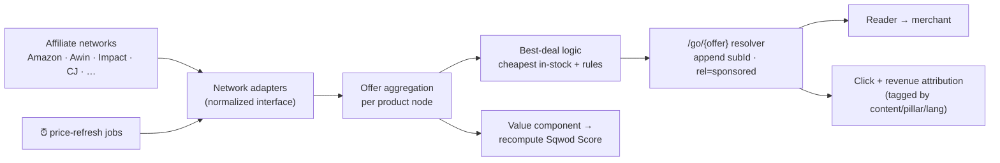

# Sqwod Verified — Product Assets & Affiliate Infrastructure (v1)

*How real 3D product views and best-deal affiliate links get into place — automatically. Includes the scaffold files now living in `infrastructure/`.*

---

## Part A — Product 3D & imagery pipeline

### The reality
There is no reliable "any product → accurate 3D model, fully automatic" today. So we tier it and always have a fallback. The viewer loads the best asset a product node has.

### The fallback chain (per product)
```
1. 3D model (.glb)        → hero products: drag-to-spin, all sides   [best]
2. 360° spin set (frames) → captured turntable images, swipe to rotate
3. 2D gallery             → high-res images (auto-pulled from affiliate feeds)
4. Generic ring/seed mesh → the stand-in you already saw            [fallback]
```
The review/list components check `asset.type` and render accordingly — no broken states, ever.

### How each asset gets created (and how automated)
| Asset | Source | Automation |
|---|---|---|
| 2D images | Affiliate product feeds (Amazon PA-API, Awin, etc.) include image URLs | **Fully automatic** — pulled with the offer data |
| 3D `.glb` (hero) | (a) manufacturer/brand media kits where offered; (b) **AI image-to-3D** from product photos (Luma/Tripo-style APIs); (c) commissioned model | **Semi-automatic** — Claude queues + optimizes; capture/gen is triggered per hero product |
| 360° spin (hero) | Turntable photography (DIY rig or outsourced), 24–72 frames stitched | **Manual capture → automatic stitch & wire-in** |

### Claude's role (orchestration)
- Detects products flagged `tier: hero` that lack a 3D/360 asset → opens a queue item.
- For AI-3D: calls the image-to-3D API with the feed images, validates the mesh, **compresses the `.glb`** (Draco), generates a poster image, writes the asset to the store, links it to the product node.
- For 2D: ingests feed images automatically on every product sync.
- Everything keyed to the product node (Phase 3 wiki), so the viewer "just works."

### Recommendation
Launch with **2D auto-pull for the whole catalog + 3D/360 for ~10–20 hero products** (your top picks per category). Expand 3D as products prove traffic. The generic mesh covers anything in between. Decision for you later: do we self-capture heroes, or outsource a 3D pack — I can set up either workflow.

---

## Part B — Affiliate infrastructure

### The model in one line
Each product = a node; each merchant offer = an **Offer** fact (price, stock, link). The system aggregates offers across all networks, picks the **best in-stock deal**, generates a **tracked deep link**, and **refreshes on a schedule** — which feeds the Value component of the Sqwod Score.



### Networks to join (prioritized — DE/EU-first, since the brand is bilingual/Berlin)
**Tier 1 — join first:**
- **Amazon Associates** (Product Advertising API) — huge catalog, both `.de` and `.com`; programmatic prices + images.
- **Awin** — dominant in Germany/EU; hosts many wellness/fitness + D2C brands.

**Tier 2 — broaden coverage:**
- **Impact.com** — where many D2C brands run (Oura, Whoop, etc.).
- **CJ (Commission Junction)** and **Rakuten Advertising** — large US/global merchant base.

**Tier 3 — convenience / gap-fill:**
- **Sovrn Commerce (Skimlinks)** — auto-affiliatizes merchants you haven't joined directly (a safety net).
- **Belboon / Digistore24** — German-market + digital products.
- **Direct brand programs** where rates beat the networks.

You join; you drop the keys/affiliate IDs into the secrets file (never the repo); Claude wires each adapter.

### Best-deal logic (configurable)
Default rule: lowest **total** price (incl. shipping where known) among **in-stock** offers, with tie-breakers for (1) merchant reliability, (2) return policy, (3) commission only as a last tie-break — never as a ranking factor. Subscriptions (e.g. Oura's €70/yr) shown but flagged separately so "price" stays honest.

### Tracking & attribution
- Every outbound link routes through **`/go/{offerId}`** → 302 to the network deep link with a **subId** encoding `contentId:pillar:lang`. That's how revenue maps back to the exact article/guide and pillar (ties into Phase 5 instrumentation).
- Click logging is **first-party and consent-gated** (GDPR).

### Refresh & freshness
- **Scheduled jobs** (per network, rate-limited) re-poll offers → update price, stock, and **price_history** → recompute Value + Sqwod Score → bump the page's `last_updated`. That's what makes "live deal" and "Updated {date}" real.
- Out-of-stock or stale offers auto-demote so we never send readers to a dead deal.

### Compliance (both markets, automatic)
- Disclosure block auto-injected on any page that renders an offer (**Anzeige/Werbung** for DE, FTC-style for EN).
- Affiliate anchors carry `rel="sponsored nofollow"`.
- "Price as of {date}" stamp + currency/VAT context.
- No tracking before consent (CMP).

---

## What I scaffolded now (in `infrastructure/`)
Ready to wire into the Astro repo the moment we scaffold the site and you provide keys:

- **`affiliate-networks.example.yaml`** — the network registry: which networks, their adapter type, market, status, and per-network settings (placeholders, no secrets).
- **`.env.example`** — every credential the adapters expect (you fill real values in a real `.env`, which stays out of git).
- **`schemas/offer.schema.json`** — the Offer data model (price, currency, merchant, stock, link, history) the aggregator + best-deal logic read.
- **`schemas/product-asset.schema.json`** — the asset model powering the viewer fallback chain (glb / spin / image / fallback).

---

## What you do next
1. **Join Tier 1 first** (Amazon Associates + Awin), then Tier 2 as you have time.
2. For each, grab the **API credentials + your affiliate/publisher ID** and hand them to me — I'll drop them into the real `.env` and flip that network's `status` to `active` in the registry.
3. Tell me your **first hero products** (your top pick per launch category) so I can set up their 3D/360 capture or AI-3D generation.

Once Amazon + Awin are live, the Sqwod Score's Value component and the "Best deal" buttons stop being mockup numbers and start pulling real prices automatically.
