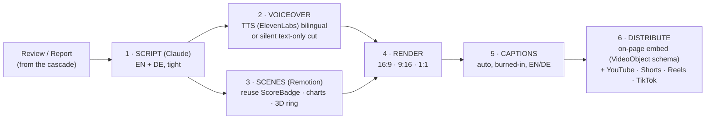

# Video Automation (v1)

*Does video help, and how do we automate it? Short answer: yes on SEO, GEO, and conversion — and the automation reuses the site's own components, so Claude Code owns it.*

---

## Why video earns its place

- **SEO** — video can win video rich-results, raises dwell time and engagement signals, and YouTube is effectively the #2 search engine: its own discovery + distribution channel. A review page with an embedded, transcript-backed video competes for more SERP real estate.
- **GEO (generative engines)** — AI answer engines (Google AI Overviews, Perplexity, ChatGPT search) increasingly surface and cite multimodal content, and they ingest **transcripts/captions** for retrieval. Structured video + transcript + `VideoObject` schema makes Sqwod content more *citeable* by the engines, not just rankable.
- **Conversion** — product video reduces purchase uncertainty at the decision moment. A 30-second "why it scored 89" + the rotatable ring directly attacks the hesitation that kills affiliate clicks.

**Caveat (important):** thin, auto-spun video is noise and can hurt trust + rankings. We automate production, not judgment — every clip has to be genuinely useful and on-brand, same bar as the written work.

---

## The automated pipeline (code-first, reuses what we built)

The killer fit is **Remotion** — programmatic video rendered in React. It means videos are built from the **same components** as the site: the `ScoreBadge`, the monochrome charts, the spinning 3D ring. No separate design system, no manual editing, fully ownable by Claude Code.

**Where it slots in:** this becomes cascade step **5.5** (between newsletter and social), so one source now also yields video — in both languages, in three aspect ratios.

**Formats & types:**
- *Sqwod Score in 30s* — per hero product (badge reveal → 3 reasons → best deal → spin).
- *Top 5 in 60s* — per category buyer's guide (the "list" as a vertical short).
- *Data explainers* — from Sqwod Intelligence reports (animated monochrome charts).

**Distribution doubles as growth:** on-page embeds help SEO/GEO + conversion; the vertical cuts feed Shorts/Reels/TikTok for top-of-funnel reach (Pillar 5) and route back to the page.

---

## Cost / ownership
Remotion (open-source, self-hosted render — Claude Code owns it), TTS usage-based (ElevenLabs), distribution via platform APIs. No video-editor SaaS, no editor headcount. Add to the **roadmap at V1** (after the written cascade is humming at MVP) so we don't split focus before the core engine is proven.

> Decision for later: do we add **voiceover** at launch (more polished, costs TTS + adds a QA step) or start **text-on-screen silent** cuts (cheaper, great for muted social autoplay)? My lean: silent text-first for social, add VO for hero product + report explainers.
